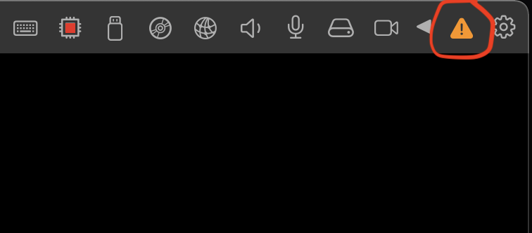
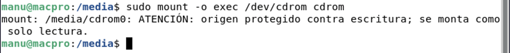
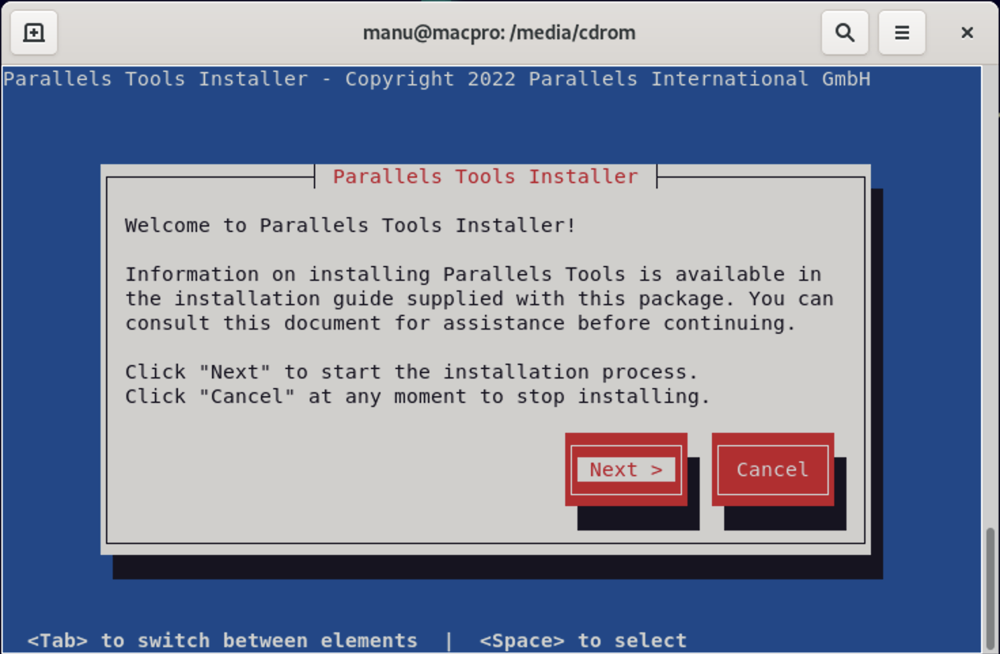

# Guia de instalacion de parallels Tools 

Buenas en este espacio enseñare a instalar las parallels tools en debian para los mac con procesadores `M1` ya que yo tuve muchos problemas a la hora de instalas pero luego de varios intentos encontre la solución asi que en este espacio explicare como hacerlo para que no tengan ningun fallo. Asi que vamos con la instalación

Lo primero que tenemos que hacer es abrir nuestro parallels como es logico y acto seguido debemos inciar nuestra maquina virtual de debian.
`(esta instalación solo es para debian con el entorno gnome)`

Una vez iniciada nuestra maquina virtual con debian tenemos que dirigirnos a la parte superior del menu y a la izquierda del todo encontraremos ciertas funciones de la aplicacion de parallels en nuestro caso tendremos que hacer doble clic en la señal de advertencia que como dije aparece en la parte superior

Lo que tenemos que hacer a continuación es remontar la imagen de instalación nuevamente en el modo `exec` entonces para ello lo que tenemos que hacer es acceder al directorio media y una vez dentro lo que haremos es desmontar la unidad de instalación para ello haremos uso del siguiente comando.

> cd /media && sudo umount cdrom0

Si nos aparece un mensaje diciendo que el medio de instalación esta ocupado lo que haremos es expulsarlo de manera grafica dirigiendonos a la carpeta media por el entorno gráfico .

Una vez esta desmontado el medio de instalación lo que haremos es montarlo nuevamente para ello haremos uso del comando 

> sudo mount -o exec /dev/cdrom cdrom

Una vez montado lo que haremos es hacerlo un ejecutable para ello lo que haremos es acceder al directorio `cdrom` a través del comando

> cd cdrom

Una vez dentro del directorio `cdrom` lo que haremos es instalar las parallels tools haciendo uso del siguiente comando

> sudo ./install

Con esto ya comenzaria la instalación de la herramienta parallels tools box, Espero que esta pequeña guia les sirva de ayuda ya que yo tuve muchos problemas a la hora de instalar estas herramientas. pronto ire añadiendo imágenes para que esta guía sea un poco mas gráfica  y también comprobare si esta guía sirve para los demas entornos gráficos de debian :)

Nos vemos pronto ✌🏻

